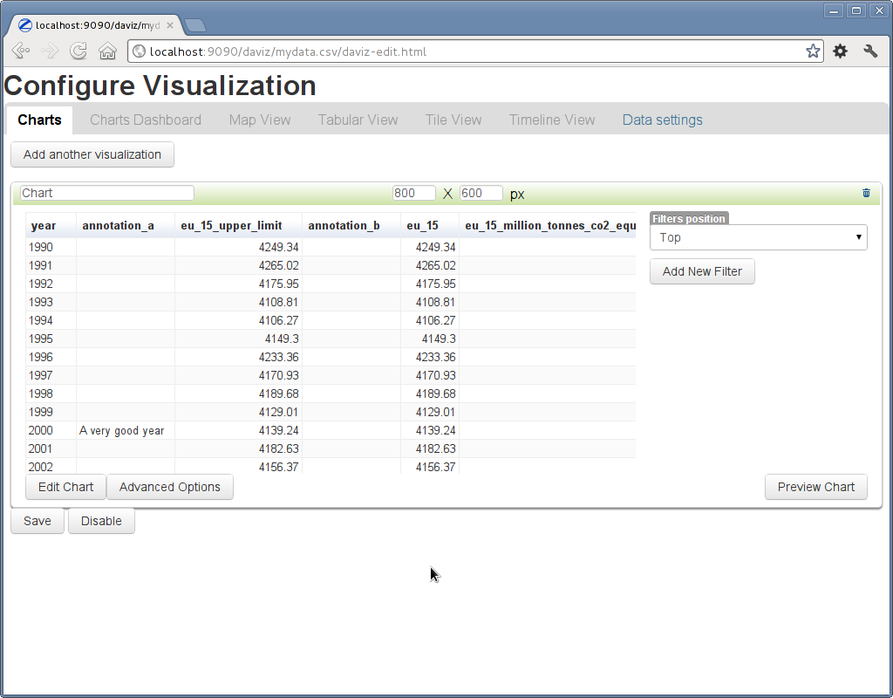

Integration with Zope and other Zope frameworks
===============================================
EEA Visualization packages were designed to work also outside Plone/CMF,
having a minimal dependency of Zope 2. Not all the Visualization packages are
Plone independent, that's why you may not find all the features provided by
EEA Daviz bundle for Plone in the Zope version of these packages.

The following diagram describes how packages depends each other and which one
are Plone dependent or not:

.. image:: images/eea.daviz.dependencies.svg

Where should I start?
---------------------
We prepared for you a `demo buildout`_ containing all the visualization packages
that also work on Zope. If you, for example, want only Google Charts
integration you can start with `Google Charts`_ demo buildout, same for the
`Simile Exhibit`_ integration.

Considering that you already ran one of the above buildouts and your Zope
instance is up and running, let's see how this is supposed to work:

1. Data source
++++++++++++++
You will need a Tab/Comma separated file, currently the only supported data
formats for Zope integration (more about extending this can be found within the
`EEA App Visualization API`_ documentation).

Upload the above file within a Zope existing Folder using the Zope Management
Interface (ZMI)::

  http://localhost:9090/daviz/manage_addProduct/OFSP/fileAdd

.. image:: images/eea.daviz.zope-addFile.png
.. image:: images/eea.daviz.zope-addedFile.png

2. Visualization
++++++++++++++++
In order to visualize this data file you either **add a specific visualization
object** (we called it Daviz Visualization), or you just **enable visualization
in-place** on the file object. As the first option is available only for the
Plone users, and that's because there is no standard API for related items
in Zope,  we'll have to stick to the **in-place enabling** solution. Still, you
can easily extend this within your custom integrations.

Enable visualization::

  http://localhost:9090/daviz/mydata.csv/daviz_support/enable

This will enable visualization for current file and redirect you to the
visualization editor page::

  http://localhost:9090/daviz/mydata.csv/daviz-edit.html

After your done editing the visualization you can view the results at::

  http://localhost:9090/daviz/mydata.csv/daviz-view.html

.. image:: images/eea.daviz.zope-daviz-view.html.png

To disable visualization, you'll have to simply call::

  http://localhost:9090/daviz/mydata.csv/daviz_support/disable

``XXX: To be continued...``

.. _`demo buildout`: https://github.com/collective/eea.daviz/tree/master/buildouts/zope2
.. _`Simile Exhibit`: https://github.com/collective/eea.exhibit/tree/master/buildouts/zope2
.. _`Google Charts`: https://github.com/collective/eea.googlecharts/tree/master/buildouts/zope2
.. _`EEA App Visualization API`: http://eea.github.com/docs/eea.app.visualization/api/API.html
